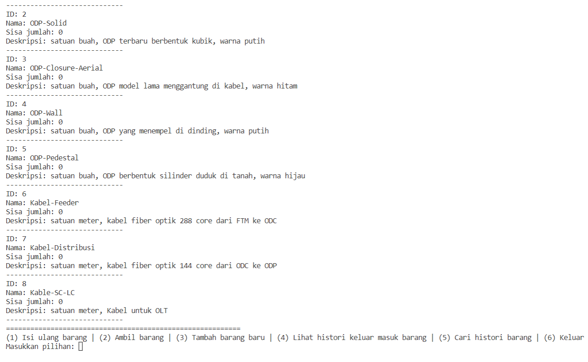
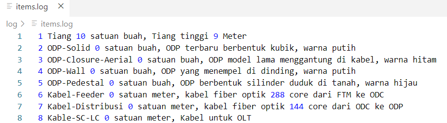
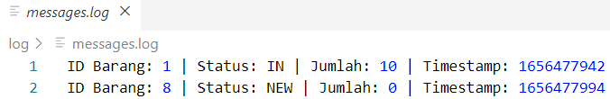

# Aplikasi Logging Gudang Gamas STO

Aplikasi logging gudang gamas STO untuk mencatat semua keluar masuk barang. Dibuat menggunakan Haskell, aplikasi ini ditujukan untuk staf yang mengelola inventaris di gudang gamas suatu STO.

## Fitur
1. Mencatat inventaris ke dalam database log

2. Mencatat aktivitas inventaris dalam log (misal mengisi ulang dan mengambil barang dalam inventaris)

## Cara menggunakan
1. Install GHC, cabal-install dan haskell-language-server via [GHCup] (https://www.haskell.org/ghcup/)
2. Buka terminal, dan ubah direktori ke proyek ini
3. Jalankan `$ cabal build`
4. Setelah berhasil dibangun, jalankan proyek ini dengan `$ cabal run`

## File presentasi
https://docs.google.com/presentation/d/1ReS--nCJ2yf3ePQzS4tvLSHiDUXHotJxkSi74cVtZg8/
